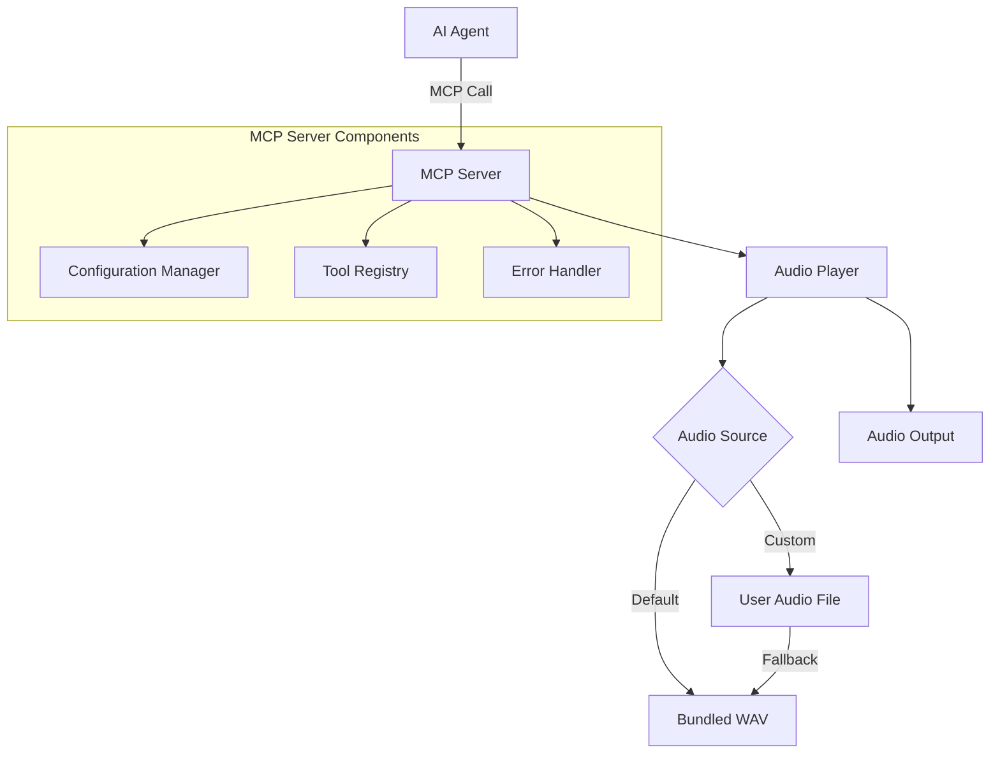
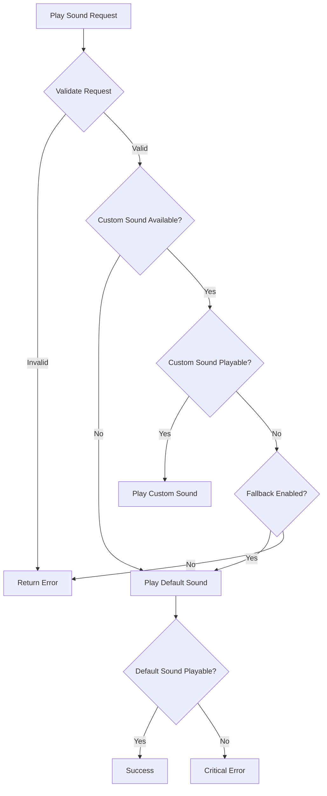

# Architecture Design

## System Overview

The Play Sound MCP Server is designed as a lightweight, reliable audio notification system for AI agents. The architecture prioritizes simplicity, reliability, and graceful error handling.

## High-Level Architecture



## Component Architecture

### 1. MCP Server Layer (`server.py`)

**Responsibilities:**
- MCP protocol implementation using FastMCP
- Tool registration and routing
- Request validation and error handling
- Configuration initialization

**Key Components:**
```python
class PlaySoundServer:
    def __init__(self, config: ServerConfig):
        self.mcp = FastMCP("play-sound")
        self.audio_player = AudioPlayer(config)
        self.config = config
        
    @mcp.tool()
    async def play_notification_sound(
        self, 
        message: str = "", 
        sound_type: str = "auto"
    ) -> str:
        """Play a notification sound to alert the user."""
```

### 2. Audio Player Layer (`audio_player.py`)

**Responsibilities:**
- Audio file loading and validation
- Playback execution with error handling
- Format conversion and fallback logic
- Resource management

**Architecture:**
```python
class AudioPlayer:
    def __init__(self, config: ServerConfig):
        self.config = config
        self.default_sound = self._load_default_sound()
        self.custom_sound = self._load_custom_sound()
    
    async def play_sound(self, sound_type: str = "auto") -> PlaybackResult:
        """Play sound with intelligent fallback."""
```

### 3. Configuration Layer (`config.py`)

**Responsibilities:**
- Environment variable parsing
- Configuration validation
- Default value management
- Path resolution and security

**Schema:**
```python
@dataclass
class ServerConfig:
    custom_sound_path: Optional[str] = None
    volume_level: float = 0.8
    enable_fallback: bool = True
    max_file_size_mb: int = 10
    playback_timeout_seconds: int = 30
```

## Audio Playback Strategy

### Primary Strategy: simpleaudio

```python
import simpleaudio as sa

class SimpleAudioPlayer:
    def play_wav(self, file_path: str) -> PlaybackResult:
        try:
            wave_obj = sa.WaveObject.from_wave_file(file_path)
            play_obj = wave_obj.play()
            # Non-blocking return, audio plays in background
            return PlaybackResult.success()
        except Exception as e:
            return PlaybackResult.error(str(e))
```

### Fallback Strategy: pydub + simpleaudio

```python
from pydub import AudioSegment
from pydub.playback import play

class PydubAudioPlayer:
    def play_any_format(self, file_path: str) -> PlaybackResult:
        try:
            audio = AudioSegment.from_file(file_path)
            # Convert to WAV in memory if needed
            play(audio)
            return PlaybackResult.success()
        except Exception as e:
            return PlaybackResult.error(str(e))
```

## Error Handling Strategy

### Layered Error Handling

1. **Validation Layer**: File existence, format, size checks
2. **Playback Layer**: Audio library errors, device unavailability
3. **Fallback Layer**: Automatic fallback to default sound
4. **Reporting Layer**: Clear error messages to MCP client

### Error Flow



## Security Architecture

### File Access Security

```python
class SecurityValidator:
    ALLOWED_EXTENSIONS = {'.wav', '.mp3', '.flac', '.ogg', '.m4a'}
    MAX_FILE_SIZE = 10 * 1024 * 1024  # 10MB
    
    def validate_audio_file(self, file_path: str) -> ValidationResult:
        # Path traversal prevention
        # Extension validation
        # File size limits
        # Existence checks
```

### Resource Protection

- **Memory Limits**: Prevent large file loading
- **Timeout Protection**: Limit playback duration
- **Concurrent Limits**: Prevent audio spam
- **Path Sanitization**: Prevent directory traversal

## Configuration Architecture

### Environment-Based Configuration

```bash
# Required: None (all optional with defaults)
CUSTOM_SOUND_PATH=/path/to/notification.wav
VOLUME_LEVEL=0.8
ENABLE_FALLBACK=true
MAX_FILE_SIZE_MB=10
PLAYBACK_TIMEOUT_SECONDS=30
```

### Configuration Validation

```python
class ConfigValidator:
    def validate_config(self, config: ServerConfig) -> ValidationResult:
        # Volume range validation (0.0-1.0)
        # File path existence and permissions
        # Timeout range validation
        # Boolean value validation
```

## Packaging Architecture

### Python Package Structure

```
mcp-server-play-sound/
├── src/
│   └── mcp_server_play_sound/
│       ├── __init__.py
│       ├── __main__.py        # Entry point
│       ├── server.py          # MCP server
│       ├── audio_player.py    # Audio logic
│       ├── config.py          # Configuration
│       ├── security.py        # Security validation
│       └── utils.py           # Utilities
├── src/assets/
│   └── default_notification.wav
├── tests/
├── pyproject.toml
└── README.md
```

### Entry Point Design

```python
# __main__.py
def main():
    """Main entry point for the MCP server."""
    config = ServerConfig.from_environment()
    server = PlaySoundServer(config)
    server.run()

if __name__ == "__main__":
    main()
```

## Performance Architecture

### Asynchronous Design

- **Non-blocking Playback**: Audio plays in background
- **Async Tool Methods**: MCP tools return immediately
- **Resource Cleanup**: Proper cleanup of audio resources

### Memory Management

```python
class AudioCache:
    def __init__(self, max_cache_size: int = 5):
        self.cache = {}
        self.max_size = max_cache_size
    
    def get_audio(self, file_path: str) -> Optional[AudioObject]:
        # LRU cache for frequently used sounds
```

## Testing Architecture

### Test Categories

1. **Unit Tests**: Individual component testing
2. **Integration Tests**: MCP protocol testing
3. **Audio Tests**: Playback functionality (with mocking)
4. **Security Tests**: File validation and path security
5. **Configuration Tests**: Environment variable handling

### Mock Strategy

```python
class MockAudioPlayer:
    """Mock audio player for testing without actual audio output."""
    
    def play_sound(self, sound_type: str) -> PlaybackResult:
        # Simulate playback without actual audio
        return PlaybackResult.success()
```

## Deployment Architecture

### Distribution Strategy

1. **PyPI Package**: `pip install mcp-server-play-sound`
2. **uvx Support**: `uvx mcp-server-play-sound`
3. **Docker Image**: For containerized environments
4. **Standalone Executable**: Future consideration

### Installation Requirements

- **Python**: 3.10+
- **System Audio**: Working audio output device
- **Permissions**: File system access for custom sounds

## Future Architecture Considerations

### Cross-Platform Expansion

- **Windows Support**: Additional audio backend options
- **Linux Support**: ALSA/PulseAudio integration
- **Mobile Support**: iOS/Android considerations

### Feature Extensions

- **Multiple Sounds**: Different notification types
- **Volume Control**: Per-notification volume
- **Audio Effects**: Fade in/out, pitch adjustment
- **Playlist Support**: Sequential sound playback

### Performance Optimizations

- **Audio Streaming**: For large files
- **Hardware Acceleration**: Platform-specific optimizations
- **Caching Strategies**: Intelligent audio caching
